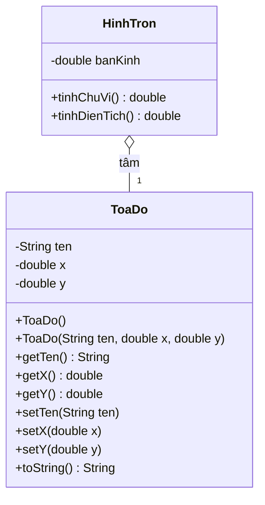
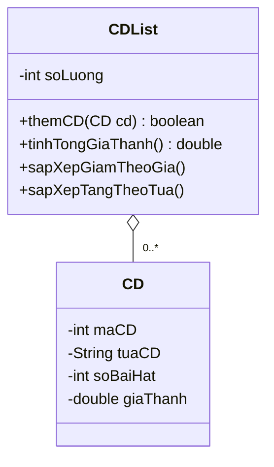
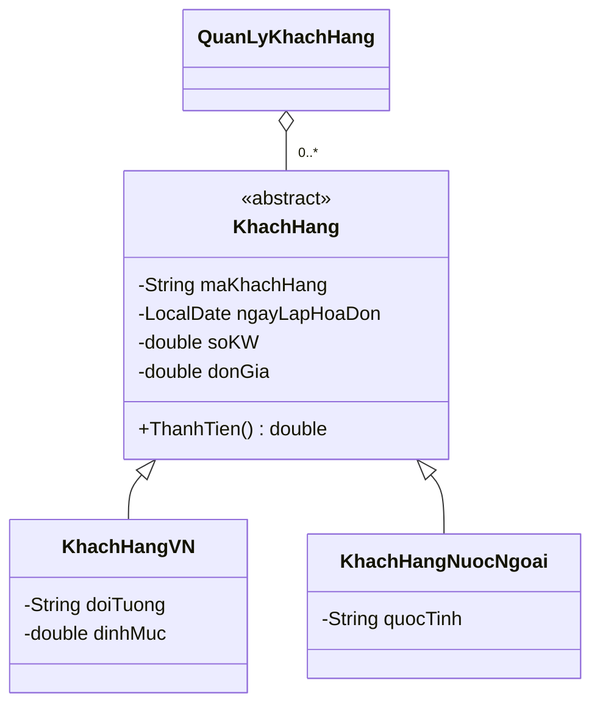
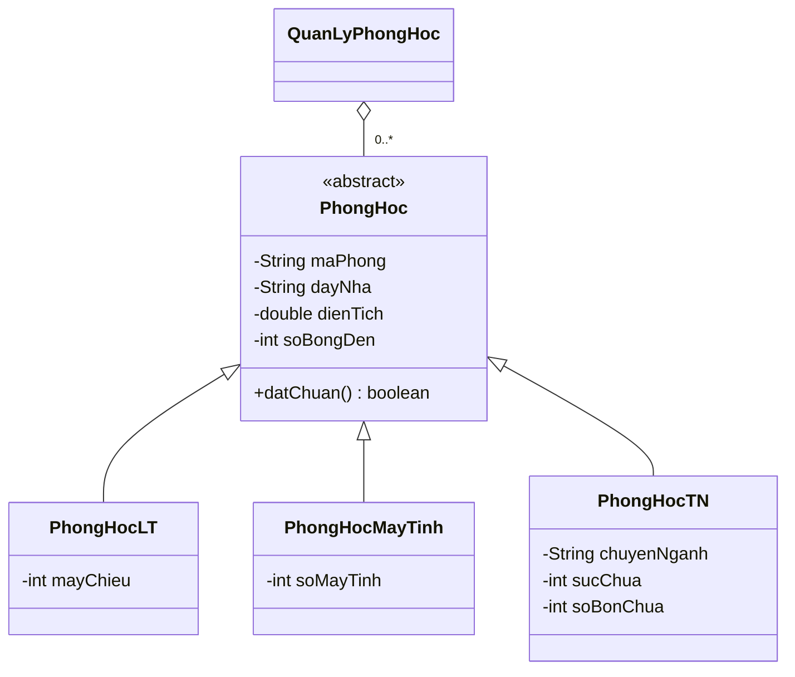

# BaiTapOOP
## Mô hình lớp

### Tuần 1 · Tọa độ và hình tròn

```mermaid
classDiagram
    class ToaDo {
        -String ten
        -double x
        -double y
        +ToaDo()
        +ToaDo(String ten, double x, double y)
        +getTen() String
        +getX() double
        +getY() double
        +setTen(String ten)
        +setX(double x)
        +setY(double y)
        +toString() String
    }
    class HinhTron {
        -double banKinh
        +tinhChuVi() double
        +tinhDienTich() double
    }
    HinhTron o-- "1" ToaDo : tâm
```

### Tuần 4 · Danh sách CD

```mermaid
classDiagram
    class CD {
        -int maCD
        -String tuaCD
        -int soBaiHat
        -double giaThanh
    }
    class CDList {
        -int soLuong
        +themCD(CD cd) boolean
        +tinhTongGiaThanh() double
        +sapXepGiamTheoGia()
        +sapXepTangTheoTua()
    }
    CDList o-- "0..*" CD
```

### Tuần 7 · Hóa đơn tiền điện

```mermaid
classDiagram
    class KhachHang {
        <<abstract>>
        -String maKhachHang
        -LocalDate ngayLapHoaDon
        -double soKW
        -double donGia
        +ThanhTien() double
    }
    class KhachHangVN {
        -String doiTuong
        -double dinhMuc
    }
    class KhachHangNuocNgoai {
        -String quocTinh
    }
    QuanLyKhachHang o-- "0..*" KhachHang
    KhachHang <|-- KhachHangVN
    KhachHang <|-- KhachHangNuocNgoai
```

### Tuần 9 · Quản lý phòng học

```mermaid
classDiagram
    class PhongHoc {
        <<abstract>>
        -String maPhong
        -String dayNha
        -double dienTich
        -int soBongDen
        +datChuan() boolean
    }
    class PhongHocLT {
        -int mayChieu
    }
    class PhongHocMayTinh {
        -int soMayTinh
    }
    class PhongHocTN {
        -String chuyenNganh
        -int sucChua
        -int soBonChua
    }
    QuanLyPhongHoc o-- "0..*" PhongHoc
    PhongHoc <|-- PhongHocLT
    PhongHoc <|-- PhongHocMayTinh
    PhongHoc <|-- PhongHocTN
```
